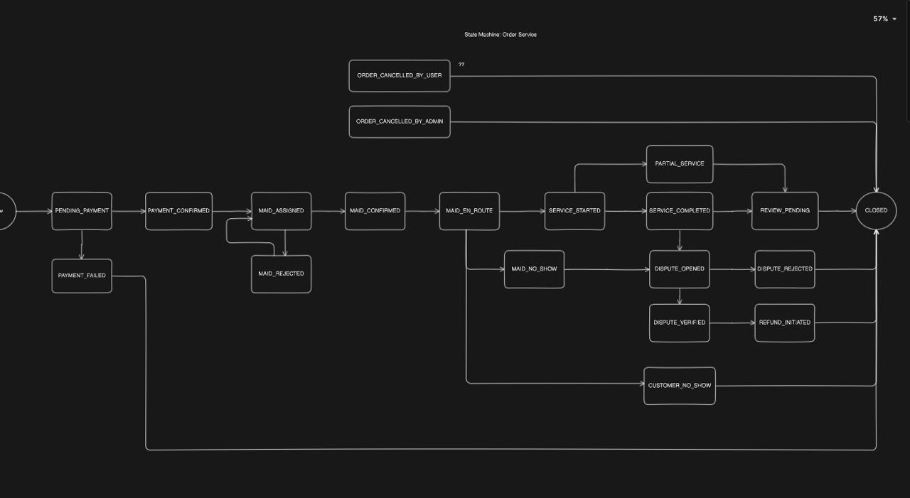
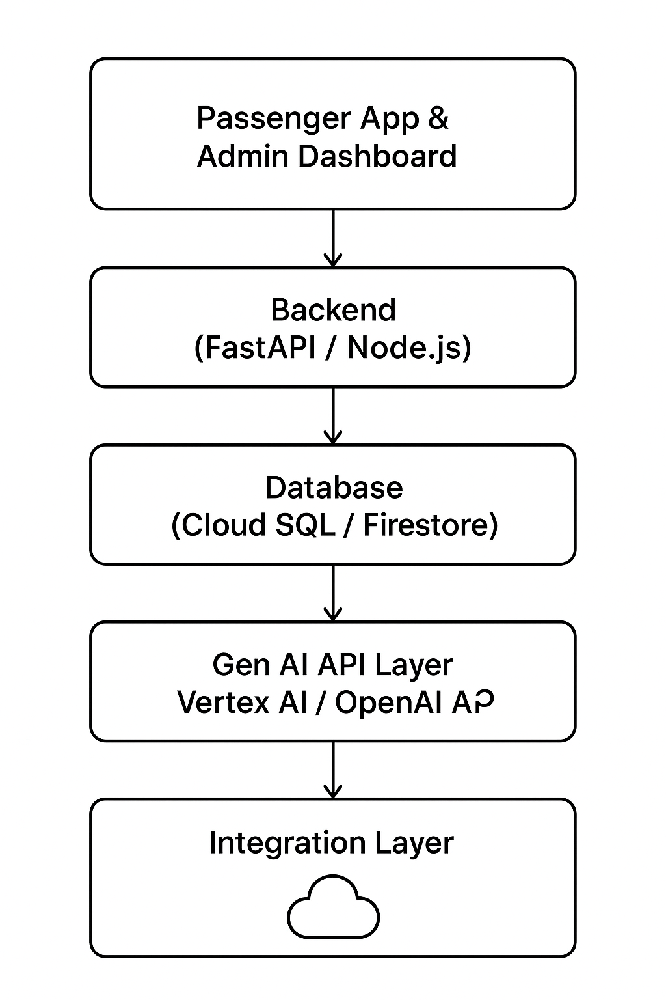

# SmartFleet AI – Intelligent Bus Allocation & Passenger Management

SmartFleet AI is a **Gen AI–powered smart transport management system** designed to optimize public bus services.  
It integrates **real-time passenger data** (via ticket machines), **AI-driven predictions** (using Google Vertex AI / OpenAI APIs), and **automated bus allocation** with microservices.  

The system reduces **fuel wastage**, ensures **better passenger convenience**, and enables governments or KSRTC to **centralize fleet control**.  

---

## Problem Statement
Public bus services currently face challenges due to:
- Underutilized buses running with very few passengers.  
- Fuel wastage from parallel buses with low occupancy.  
- Lack of predictive insights for seat booking and demand at stops.  
- Poor visibility and control for government fleet managers.  

---

## Objectives
- Enable **real-time passenger count tracking** via IoT-enabled ticket machines.  
- Predict occupancy levels and demand at each stop using **Gen AI APIs**.  
- **Allocate or shuffle buses dynamically** based on passenger flow.  
- Provide **mobile pre-booking** with AI-driven demand forecasting.  
- Offer a **centralized dashboard** for transport authorities.  

---

## Unique Selling Proposition (USP)
Unlike traditional bus tracking apps, **SmartFleet AI** combines:
- Real-time passenger data  
- AI-driven fleet allocation  
- Predictive demand planning  

to **save fuel, reduce costs, and enhance efficiency** in public transport.  

---

## Features
- Real-time passenger count (via ticket machines)  
- AI-driven bus allocation (Vertex AI / OpenAI API)  
- Passenger pre-booking with demand forecasting  
- Centralized Admin Dashboard (KSRTC/Govt.)  
- Notifications for passengers & drivers  
- Scalable microservices with **Nest.js + RabbitMQ**  
- Mobile-first design (Flutter for passengers, React.js dashboard for admins)  

---

## System Architecture



**Key Components:**
1. **Frontend**
   - Passenger Mobile App (Flutter)
   - Admin Dashboard (React.js with Nx)

2. **Backend (Nest.js Microservices)**
   - Auth Service – login, JWT, roles  
   - Passenger Service – bookings, seat allocation  
   - Fleet Service – bus management  
   - Notification Service – push/SMS/Email  
   - IoT Service – ticket machine & GPS data  
   - **AI Decision Service** – Gen AI brain for predictions and allocations  

3. **Message Broker**
   - RabbitMQ for inter-service communication  

4. **Database**
   - Cloud SQL / Firestore for persistence  
   - Redis for real-time caching  

5. **AI Layer**
   - Google Cloud Vertex AI / OpenAI API for predictive demand planning  

---

## File Structure

```

smartfleet-ai/
│
├── frontend/
│   ├── passenger-app/               # Flutter app
│   ├── admin-dashboard/             # React.js (Nx) dashboard
│
├── backend/
│   ├── apps/
│   │   ├── auth-service/            # Authentication
│   │   ├── passenger-service/       # Bookings, seats
│   │   ├── fleet-service/           # Fleet allocation
│   │   ├── notification-service/    # Alerts
│   │   ├── iot-service/             # IoT integration
│   │   ├── ai-decision-service/     # AI decision making
│   │   │   ├── src/
│   │   │   │   ├── models/          # AI models, prompt templates
│   │   │   │   ├── services/        # Vertex AI / OpenAI integration
│   │   │   │   ├── controllers/     # APIs for predictions
│   │   │   │   └── utils/           # Helpers
│   │   │   └── README.md            # AI service docs
│   │
│   ├── libs/                        # Shared DTOs, utils
│   ├── rabbitmq/                    # Queue setup
│   ├── docker/                      # Service Docker configs
│
├── database/
│   ├── migrations/                  # DB schemas
│   ├── seeds/                       # Sample data
│
├── docs/
│   ├── architecture.png             # Architecture diagram
│   ├── process-flow\.png             # Process flow diagram
│   ├── ai-pipeline.png              # AI decision pipeline
│   ├── wireframes/                  # App & dashboard mockups
│
├── deployment/
│   ├── docker-compose.yml           # Local setup
│   ├── k8s/                         # Kubernetes manifests
│
├── .env.example                     # Example env variables
├── README.md                        # Project documentation
└── LICENSE

```

## Process Flow



1. Passenger books a seat → Passenger Service updates DB.  
2. Ticket machine sends **real-time occupancy data** → IoT Service forwards to Fleet Service.  
3. Fleet Service requests **AI Decision Service** → AI predicts demand & recommends allocation.  
4. Fleet Service triggers RabbitMQ → Notification Service alerts drivers/passengers.  
5. Admin Dashboard shows real-time occupancy, predictions & allocations.  

---

## AI Decision Service (Core Gen AI Brain)
- Collects **inputs**: passenger counts, pre-bookings, GPS, bus routes.  
- Sends data to **Google Vertex AI / OpenAI APIs** with custom prompt templates.  
- Returns:  
  - Merge low-occupancy buses (fuel saving).  
  - Allocate new bus if demand > capacity.  
  - Predict demand at upcoming stops for proactive planning.  

---

## Technologies Used
- **Frontend**: Flutter (Passenger App), React.js + Nx (Dashboard)  
- **Backend**: Nest.js (Microservices)  
- **Message Broker**: RabbitMQ  
- **Database**: Cloud SQL / Firestore + Redis  
- **AI Layer**: Google Vertex AI / OpenAI APIs  
- **Deployment**: Docker, Kubernetes, Google Cloud Run  

---

## Estimated Implementation Cost
- Google Cloud Vertex AI / OpenAI APIs: **₹4,000 – ₹8,000/month**  
- Cloud SQL / Firestore: **₹800 – ₹1,600/month**  
- Hosting & Infrastructure: **₹400 – ₹1,200/month**  
- **Total Prototype Cost: ~₹5,400 – ₹10,800/month**  

---

## Submission Deliverables
- Prototype PPT (PDF format)  
- Working Prototype Link  
- Demo Video (Google Drive link with open access)  
- Public GitHub Repository  

---

## Contact
For queries, contact: **prathampshetty99sai@gmail.com**
```


